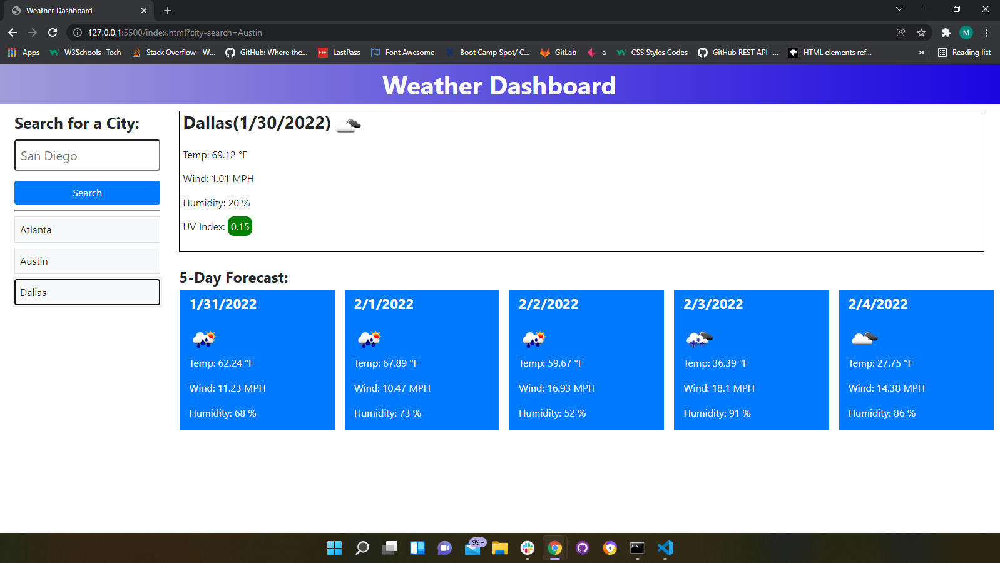

# Weather Dashboard

## Description:
This is a web-based app built to show the current and future weather conditions in a city of the user's choice. When the user enters a city, then they are presented with the current temperature, humidity, wind speed, and UV index as well as a five (5) day forecast that displays the dates, temperature, wind speed, and humidity for the next five (5) days. Searches are saved to the local storage and displayed on the app. When the user clicks on a city in the search history, they are presented with current and future conditions for that city. 

## Built With
- HTML
- CSS
- JavaScript
- OpenWeather One Call API
- Bootstrap
- JQuery

## Screenshot

## Link
https://mubohouston.github.io/weather-dashboard/
